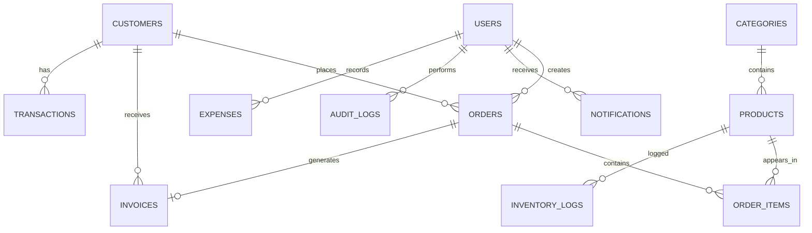
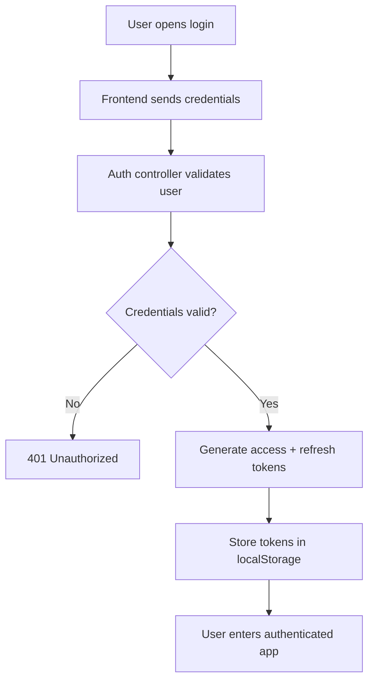
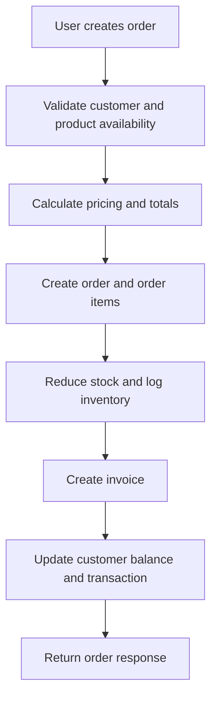
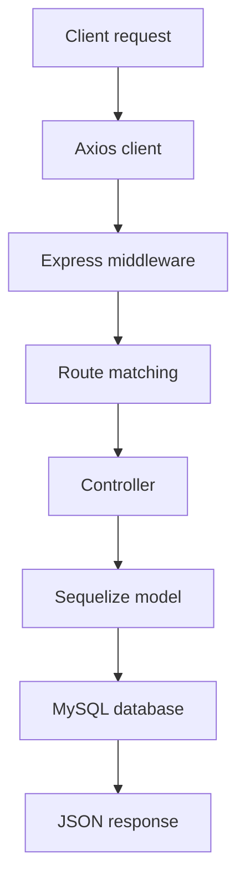
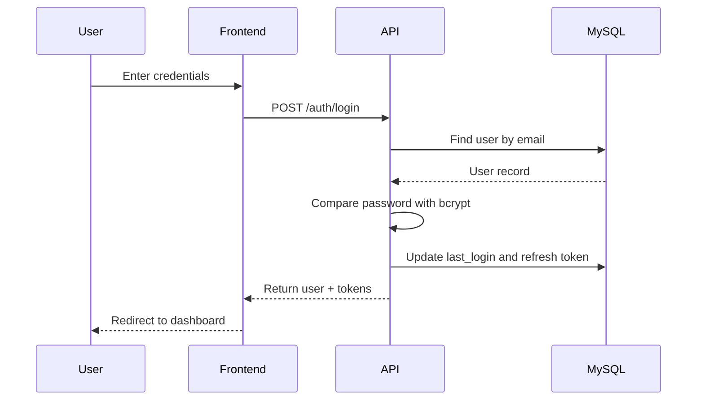
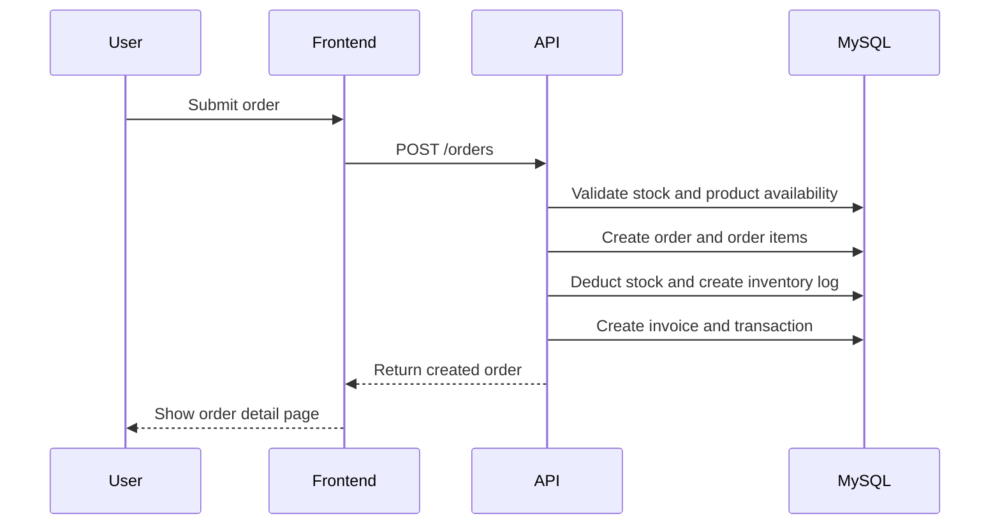
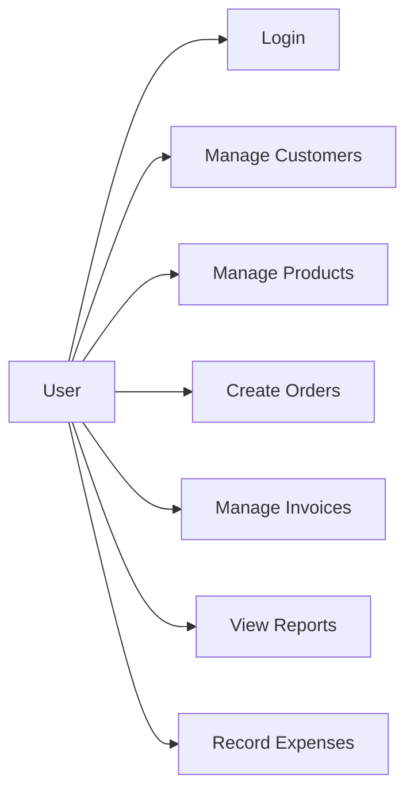
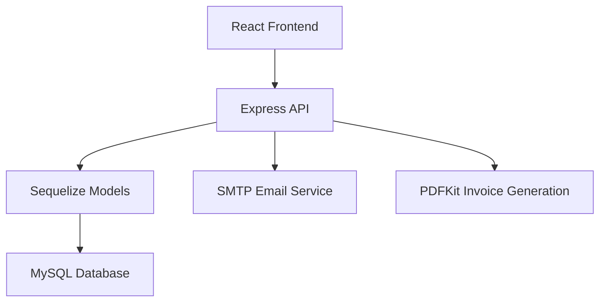
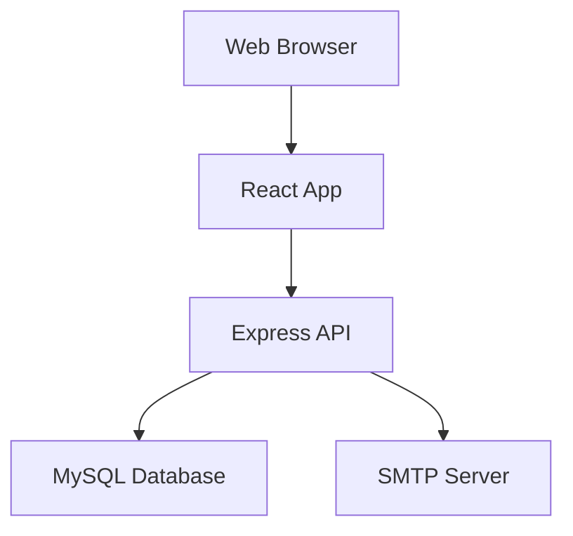

# Software Technical Documentation

## 1. Project Identification

### 1.1 Project Title
SalesOrder Pro — Sales Order Accounting Information System

### 1.2 System Name
SalesOrder Pro

### 1.3 Type of Software
A web-based enterprise resource planning (ERP-lite) and accounting information system for sales order processing, inventory control, invoicing, reporting, and expense tracking.

### 1.4 Industry Context
Small and medium-scale enterprises (SMEs), especially businesses that require order management, customer tracking, invoicing, and basic financial reporting.

### 1.5 Purpose
To provide a central digital platform for managing sales orders from creation to invoicing and reporting, while maintaining inventory movement and basic accounting visibility.

### 1.6 Main Problem Solved
The system addresses the inefficiency of manually tracking sales orders, inventory, invoices, and customer balances. It reduces spreadsheet-based operations and provides a structured way to manage critical business processes.

### 1.7 Target Users
- Business owners and managers
- Sales staff
- Accountants
- Inventory or operations personnel
- System administrators

### 1.8 Stakeholders
- End users in SMEs
- Business owners / managers
- Finance and accounting staff
- Developers and maintainers
- Database administrators
- Potential system integrators or future extension teams

### 1.9 Scope
The current implementation covers:
- Authentication and role-based access control
- Customer management
- Product and category management
- Inventory adjustment and low-stock monitoring
- Sales order creation and cancellation
- Invoice generation, email, PDF download, and payment state updates
- Expense tracking
- Dashboard analytics and reports
- Notifications and audit logging

### 1.10 Objectives
- Automate sales order handling for SME operations
- Maintain an auditable record of transactions
- Support inventory movement tracking
- Improve visibility through dashboards and reports
- Provide a role-based workflow for different organizational roles

### 1.11 Core Features
- Role-based authentication
- CRUD operations for customers, products, and expenses
- Sales order workflow with inventory deduction
- Automatic invoice creation
- PDF invoice generation
- Email invoice dispatch
- Dashboard metrics and visual reports
- Notifications for low stock and other events
- Audit logs for write operations

### 1.12 Business Value
The system improves operational control, reduces manual errors, accelerates business processes, and provides better insight into revenue, inventory, and customer obligations.

### 1.13 Real-World Application
This system can be used by a retail or wholesale business, distribution company, service-oriented SME, or office supplies vendor that manages product stock and customer billing.

---

## 2. High-Level Overview

The project adopts a client-server architecture. The frontend is a React application that presents a dashboard-driven user interface. The backend is an Express.js REST API that exposes authenticated endpoints for managing business entities. Data is stored in a MySQL relational database through Sequelize ORM.

### 2.1 System Overview
The system is organized around the following major business domains:
- Authentication and users
- Customers
- Products and inventory
- Orders and invoices
- Expenses and financial reporting
- Notifications and auditing

### 2.2 Workflow
A typical workflow is:
1. A user signs in using email and password.
2. The client stores access and refresh tokens in localStorage.
3. The user performs actions such as creating a customer, adding products, or submitting a sales order.
4. The frontend sends HTTP requests to the API.
5. The backend validates input, enforces authorization, interacts with Sequelize models, and updates the database.
6. The system responds with structured JSON payloads and, where applicable, generates invoices or notifications.

### 2.3 User Journey
A typical manager or salesperson can:
- Log in
- View dashboard metrics
- Create or manage customers
- Add or edit products
- Create a sales order
- Review generated invoice data
- Download or email invoices
- View reports and expenses

### 2.4 Data Flow
The data flow is as follows:
- Browser UI collects user input
- Axios client sends requests to the backend
- Express middleware validates authentication and input
- Controllers orchestrate business logic
- Sequelize models interact with MySQL
- Resulting data is returned to the frontend for rendering

### 2.5 Request Lifecycle
A request passes through:
- CORS, helmet, rate limiting, xss protection
- JSON/body parsing and cookie parsing
- Route matching
- Authentication/authorization middleware
- Controller logic
- Sequelize model operations
- Error handling middleware

### 2.6 Overall Execution Flow
The application starts by launching the backend server, syncing Sequelize models with the database, and then serving the React app. The frontend uses route-based navigation and API-backed pages.

---

## 3. Tech Stack

### 3.1 Programming Languages
- JavaScript
  - Used for the entire frontend and backend implementation.

### 3.2 Frontend Frameworks and Libraries
- React 18
  - Core library for building the user interface.
- React Router DOM 6
  - Handles client-side navigation and route transitions.
- Vite
  - Development server and build tool for the frontend.
- Tailwind CSS
  - Utility-first styling framework.
- React Hook Form
  - Form state and validation management.
- TanStack React Query
  - Remote data fetching, caching, and state synchronization.
- Zustand
  - Lightweight global state management for authentication state.
- React Hot Toast
  - User notifications and toasts.
- Chart.js and react-chartjs-2
  - Chart rendering for analytics dashboards and reports.
- Axios
  - HTTP client for API communication.
- date-fns
  - Date formatting utilities.

### 3.3 Backend Frameworks and Libraries
- Node.js
  - Runtime environment.
- Express.js
  - HTTP server and routing framework.
- Sequelize
  - ORM for MySQL interaction.
- MySQL2
  - Native MySQL driver for Sequelize.
- JWT (jsonwebtoken)
  - Access and refresh token generation and verification.
- bcryptjs
  - Password hashing for user credentials.
- express-validator
  - Request validation middleware.
- helmet
  - HTTP security headers.
- cors
  - Cross-origin resource sharing configuration.
- compression
  - Response compression.
- cookie-parser
  - Parsing cookies from requests.
- morgan
  - HTTP request logging.
- express-rate-limit
  - Request throttling for abuse prevention.
- xss-clean
  - Simple XSS filtering middleware.
- multer
  - File upload support (currently not heavily used in these screens).
- nodemailer
  - Email sending for invoice delivery.
- pdfkit
  - PDF generation for invoices.
- winston
  - Structured logging.
- uuid
  - Unique identifier generation.
- node-cron
  - Scheduled jobs support (present in dependencies but not used in the analyzed code).

### 3.4 Package Managers
- npm
  - Used for dependency management in both the client and server projects.

### 3.5 Runtime
- Node.js
- Browser runtime for React frontend

### 3.6 Database
- MySQL
  - Relational database engine.
  - Managed via Sequelize models.

### 3.7 Authentication
- JWT-based authentication with access and refresh tokens.
- Role-based access control implemented in middleware.

### 3.8 Storage
- MySQL database for primary data persistence.
- Local file system for uploaded assets and generated PDF files (though this implementation primarily uses in-memory PDF buffers for response delivery).

### 3.9 Networking
- RESTful HTTP API over JSON.
- CORS enabled for frontend origin.

### 3.10 Testing
- Jest and Supertest are included in server dependencies.
- No concrete test files or execution evidence were found in the workspace.

### 3.11 Build Tools
- Vite for frontend build and dev server
- Nodemon for backend development auto-reload

### 3.12 Deployment
- Intended for deployment as separate client and server services.
- Backend configured to accept environment-based port and origin values.

### 3.13 Logging
- Winston is configured to write to log files in the server logs directory.
- Morgan logs HTTP requests into the logger.

### 3.14 Why These Technologies Were Chosen
- React and Vite were chosen for fast UI development and modern component-driven frontends.
- Express and Sequelize were chosen for ease of building a REST API and working with a relational database.
- JWT was chosen because the system requires stateless authentication suitable for APIs.
- PDFKit and Nodemailer were chosen to support invoice generation and delivery.
- Tailwind was chosen to speed up styling with a consistent design system.

---

## 4. Project Structure

### 4.1 Complete Folder Tree
```text
Sales-Order-System/
├── package.json
├── README.md
├── client/
│   ├── eslint.config.js
│   ├── index.html
│   ├── package.json
│   ├── postcss.config.js
│   ├── tailwind.config.js
│   ├── vite.config.js
│   ├── public/
│   └── src/
│       ├── App.css
│       ├── App.jsx
│       ├── index.css
│       ├── main.jsx
│       ├── api/
│       │   ├── client.js
│       │   └── services.js
│       ├── assets/
│       ├── components/
│       │   ├── layout/
│       │   │   ├── AppLayout.jsx
│       │   │   └── Sidebar.jsx
│       │   └── ui/
│       │       └── index.jsx
│       ├── pages/
│       │   ├── auth/
│       │   │   └── LoginPage.jsx
│       │   ├── customers/
│       │   │   └── CustomersPage.jsx
│       │   ├── dashboard/
│       │   │   └── DashboardPage.jsx
│       │   ├── expenses/
│       │   │   └── ExpensesPage.jsx
│       │   ├── invoices/
│       │   │   └── InvoicesPage.jsx
│       │   ├── orders/
│       │   │   ├── OrderDetailPage.jsx
│       │   │   └── OrdersPage.jsx
│       │   ├── products/
│       │   │   └── ProductsPage.jsx
│       │   ├── reports/
│       │   │   └── ReportsPage.jsx
│       │   └── settings/
│       │       └── SettingsPage.jsx
│       ├── store/
│       │   └── authStore.js
│       └── utils/
│           └── helpers.js
├── database/
│   └── schema.sql
├── server/
│   ├── .env
│   ├── .env.example
│   ├── logs/
│   ├── package.json
│   └── src/
│       ├── server.js
│       ├── config/
│       │   ├── database.js
│       │   └── logger.js
│       ├── controllers/
│       │   ├── auditController.js
│       │   ├── authController.js
│       │   ├── customerController.js
│       │   ├── dashboardController.js
│       │   ├── expenseController.js
│       │   ├── invoiceController.js
│       │   ├── notificationController.js
│       │   ├── orderController.js
│       │   ├── productController.js
│       │   ├── userController.js
│       ├── database/
│       │   └── seeders/
│       │       └── index.js
│       ├── middleware/
│       │   ├── auth.js
│       │   ├── errorHandler.js
│       │   └── validate.js
│       ├── models/
│       │   ├── associations.js
│       │   ├── Customer.js
│       │   ├── index.js
│       │   ├── Order.js
│       │   ├── Product.js
│       │   └── User.js
│       ├── routes/
│       │   └── index.js
│       ├── services/
│       │   ├── emailService.js
│       │   └── pdfService.js
│       └── utils/
│           └── generators.js
```

### 4.2 Folder Responsibilities
- client/: Frontend React application
- server/: Backend Express API and business logic
- database/: SQL schema definition
- docs/: Documentation (created for this report)

### 4.3 File Responsibilities
- client/src/App.jsx: Main route definition
- client/src/api/services.js: API wrappers for all backend endpoints
- client/src/store/authStore.js: Authentication state management
- client/src/components/layout/AppLayout.jsx: Global shell with sidebar and notifications
- client/src/pages/*: Feature pages for each domain
- server/src/server.js: Node entry point and middleware initialization
- server/src/controllers/*: Business logic handlers per domain
- server/src/models/*: Sequelize schema definitions and relationships
- server/src/routes/index.js: API route registration
- server/src/services/*: Email and PDF support
- server/src/database/seeders/index.js: Demo data seeding
- database/schema.sql: Raw SQL schema definition

---

## 5. System Architecture

### 5.1 Architecture Pattern
The project uses a modular layered client-server architecture.
- Presentation layer: React pages and reusable UI components
- Application layer: Controllers and route handlers in Express
- Data access layer: Sequelize models and MySQL database
- Cross-cutting concerns: authentication, validation, logging, error handling, security middleware

### 5.2 Architectural Style
- Monolithic backend service
- Client-server frontend/backend split
- Layered structure with controllers and models
- No microservices or separate queue infrastructure

### 5.3 Component Interaction
The interaction flow is:
- UI components call service functions
- Service functions call Axios client with auth headers
- API routes invoke controllers
- Controllers use models and services
- Models persist data in MySQL
- Responses are returned to the React layer

### 5.4 Module Interaction
- Auth module is used by all protected routes
- Order module depends on product inventory logic
- Invoice module depends on order and customer info
- Reports module aggregates order, expense, and inventory data
- Notifications and audit logs receive events from other modules

### 5.5 Request Flow
1. Browser requests a page or API endpoint
2. React Router renders the required page
3. React Query fetches data from API endpoints
4. Axios attaches auth headers
5. Express middleware authorizes the request
6. Controller processes and saves or reads data
7. Database returns data
8. Response is shown in UI

### 5.6 Response Flow
Responses are standardized as JSON objects with a success field plus data/meta/message payloads.

---

## 6. Database

### 6.1 Database Engine
MySQL 8-compatible relational database.

### 6.2 Schema Strategy
The schema is defined both as raw SQL in database/schema.sql and as Sequelize model definitions in server/src/models. The runtime server synchronizes models using sequelize.sync({ alter: ... }) in development.

### 6.3 Core Entities
- users
- categories
- customers
- products
- orders
- order_items
- invoices
- transactions
- expenses
- inventory_logs
- notifications
- audit_logs

### 6.4 Entity Relationships
- A category has many products
- A customer has many orders and invoices
- An order belongs to one customer and one creator user
- An order has many order items
- Each order item belongs to one product
- An order has one invoice
- A product has many inventory logs
- A user has many notifications and audit logs

### 6.5 Primary Keys
- All major tables use UUID primary keys generated by Sequelize default UUIDV4.

### 6.6 Foreign Keys
- products.category_id -> categories.id
- orders.customer_id -> customers.id
- orders.created_by -> users.id
- order_items.order_id -> orders.id
- order_items.product_id -> products.id
- invoices.order_id -> orders.id
- invoices.customer_id -> customers.id
- invoices.issued_by -> users.id
- transactions.order_id -> orders.id
- transactions.customer_id -> customers.id
- transactions.recorded_by -> users.id
- expenses.recorded_by -> users.id
- inventory_logs.product_id -> products.id
- notifications.user_id -> users.id
- audit_logs.user_id -> users.id

### 6.7 Constraints and Validation
- User email unique
- Product SKU and product_code unique
- Customer customer_code unique
- Order number unique
- Invoice number unique
- Transaction reference unique
- Enum-based statuses and roles

### 6.8 Normalization
The schema is relational and normalized to a reasonable extent. Repeated entities such as customers, products, and users are stored separately and linked with foreign keys rather than embedded in each order.

### 6.9 ER Diagram


### 6.10 Table Explanations

#### users
Columns:
- id: UUID primary key
- name: Full name
- email: Unique login identifier
- password: Hashed password
- role: Enum role
- phone: Contact number
- avatar: Optional avatar path
- is_active: Whether user is active
- last_login: Date of latest login
- password_reset_token: Temporary reset token
- password_reset_expires: Expiration time for reset token
- refresh_token: Stored refresh token

#### categories
- id, name, description, is_active

#### customers
- id, customer_code, name, email, phone, address, city, state, country, credit_limit, outstanding_balance, is_active, notes

#### products
- id, product_code, sku, name, description, category_id, cost_price, selling_price, quantity, min_stock_level, supplier, unit, image, barcode, is_active

#### orders
- id, order_number, customer_id, created_by, status, subtotal, discount_type, discount_value, discount_amount, tax_rate, tax_amount, total_amount, amount_paid, balance_due, payment_method, notes, delivery_date

#### order_items
- id, order_id, product_id, product_name, quantity, unit_price, cost_price, discount, total

#### invoices
- id, invoice_number, order_id, customer_id, issued_by, status, subtotal, discount_amount, tax_amount, total_amount, amount_paid, balance_due, due_date, notes, pdf_path

#### transactions
- id, reference, type, order_id, customer_id, amount, payment_method, description, recorded_by

#### expenses
- id, title, category, amount, date, description, recorded_by, receipt

#### inventory_logs
- id, product_id, type, quantity_change, quantity_before, quantity_after, reference_id, notes, recorded_by

#### notifications
- id, user_id, title, message, type, is_read, link

#### audit_logs
- id, user_id, action, entity, entity_id, old_values, new_values, ip_address, user_agent

### 6.11 Database Migrations and Seeders
The project uses Sequelize synchronization rather than explicit migration files. The seeder in server/src/database/seeders/index.js creates the tables and inserts demo records. The implementation uses sequelize.sync({ force: true }) during seeding, which wipes existing data.

---

## 7. API Documentation

Base URL: /api/v1

### 7.1 Authentication Endpoints

#### POST /auth/login
- Purpose: Authenticate a user and issue JWT tokens
- Authentication: None
- Body: { email, password }
- Validation: email format, password not empty
- Response: user object + accessToken + refreshToken
- Success status: 200
- Errors: 401 for invalid credentials

#### POST /auth/register
- Purpose: Create a new user
- Authentication: Required (JWT)
- Authorization: super_admin only
- Body: { name, email, password, role, phone }
- Validation: role must be one of allowed values
- Response: created user and tokens
- Success status: 201

#### POST /auth/refresh
- Purpose: Rotate refresh token and issue new access and refresh tokens
- Authentication: None
- Body: { refreshToken }
- Response: new tokens
- Errors: 401 on invalid refresh token

#### POST /auth/logout
- Purpose: Clear refresh token
- Authentication: Required
- Response: success message

#### POST /auth/forgot-password
- Purpose: Initiate password-reset flow
- Authentication: None
- Body: { email }
- Response: generic success message

#### POST /auth/reset-password
- Purpose: Reset password using random token
- Authentication: None
- Body: { token, password }

#### GET /auth/profile
- Purpose: Return the authenticated user profile
- Authentication: Required

#### PUT /auth/profile
- Purpose: Update user name and phone
- Authentication: Required

### 7.2 Dashboard and Reports Endpoints

#### GET /dashboard/stats
- Purpose: Return dashboard KPIs, recent orders, top products, monthly revenue
- Authentication: Required

#### GET /reports/sales
- Purpose: Return sales data for charting and summary metrics
- Authentication: Required

#### GET /reports/inventory
- Purpose: Return product inventory metrics and low-stock status
- Authentication: Required

#### GET /reports/profit-loss
- Purpose: Return revenue, COGS, expenses, gross profit, net profit, margin
- Authentication: Required
- Authorization: super_admin, manager, accountant

### 7.3 Customer Endpoints

#### GET /customers
- Purpose: Paginated list of customers with search support
- Authentication: Required
- Query: page, limit, search, is_active

#### POST /customers
- Purpose: Create a customer
- Authentication: Required
- Authorization: super_admin, manager, sales_staff

#### GET /customers/:id
- Purpose: Get one customer and recent orders
- Authentication: Required

#### PUT /customers/:id
- Purpose: Update a customer
- Authentication: Required
- Authorization: super_admin, manager, sales_staff

#### DELETE /customers/:id
- Purpose: Deactivate a customer
- Authentication: Required
- Authorization: super_admin, manager

#### GET /customers/:id/transactions
- Purpose: Get transaction history for a customer
- Authentication: Required

#### GET /customers/:id/analytics
- Purpose: Return basic customer analytics (orders, total spent, overdue invoices)
- Authentication: Required

### 7.4 Product Endpoints

#### GET /products
- Purpose: Paginated product list with search and category filters
- Authentication: Required

#### POST /products
- Purpose: Create a product
- Authentication: Required
- Authorization: super_admin, manager

#### GET /products/low-stock
- Purpose: Return low-stock products
- Authentication: Required

#### GET /products/:id
- Purpose: Get product details and inventory logs
- Authentication: Required

#### PUT /products/:id
- Purpose: Update product details
- Authentication: Required
- Authorization: super_admin, manager

#### DELETE /products/:id
- Purpose: Deactivate a product
- Authentication: Required
- Authorization: super_admin, manager

#### POST /products/:id/adjust-stock
- Purpose: Adjust stock quantity and record inventory logs
- Authentication: Required
- Authorization: super_admin, manager

#### GET /categories
- Purpose: List active categories
- Authentication: Required

#### POST /categories
- Purpose: Create a category
- Authentication: Required
- Authorization: super_admin, manager

### 7.5 Order Endpoints

#### GET /orders
- Purpose: List orders with filters
- Authentication: Required

#### POST /orders
- Purpose: Create a sales order, deduct stock, generate invoice, create transaction, and update customer balance
- Authentication: Required

#### GET /orders/:id
- Purpose: Get an order with customer, items, invoice, and creator
- Authentication: Required

#### PATCH /orders/:id/status
- Purpose: Update order status
- Authentication: Required
- Authorization: super_admin, manager, accountant

#### POST /orders/:id/cancel
- Purpose: Cancel an order, restore stock, cancel invoice, and adjust balance
- Authentication: Required
- Authorization: super_admin, manager

### 7.6 Invoice Endpoints

#### GET /invoices
- Purpose: List invoices
- Authentication: Required

#### GET /invoices/:id
- Purpose: Retrieve invoice details
- Authentication: Required

#### GET /invoices/:id/download
- Purpose: Generate and return a PDF invoice
- Authentication: Required

#### POST /invoices/:id/email
- Purpose: Send invoice by email as PDF attachment
- Authentication: Required

#### PATCH /invoices/:id/mark-paid
- Purpose: Mark an invoice as paid
- Authentication: Required
- Authorization: super_admin, manager, accountant

### 7.7 User and Admin Endpoints

#### GET /users
- Purpose: Retrieve users
- Authentication: Required
- Authorization: super_admin, manager

#### PUT /users/:id
- Purpose: Update user profile and role status
- Authentication: Required
- Authorization: super_admin

#### DELETE /users/:id
- Purpose: Deactivate a user
- Authentication: Required
- Authorization: super_admin

### 7.8 Notification Endpoints

#### GET /notifications
- Purpose: Retrieve notifications for the current user
- Authentication: Required

#### PATCH /notifications/:id/read
- Purpose: Mark one notification as read
- Authentication: Required

#### PATCH /notifications/read-all
- Purpose: Mark all notifications as read
- Authentication: Required

### 7.9 Expense and Audit Endpoints

#### GET /expenses
- Purpose: List expenses
- Authentication: Required
- Authorization: super_admin, manager, accountant

#### POST /expenses
- Purpose: Record a new expense
- Authentication: Required
- Authorization: super_admin, manager, accountant

#### PUT /expenses/:id
- Purpose: Update an expense
- Authentication: Required
- Authorization: super_admin, manager, accountant

#### DELETE /expenses/:id
- Purpose: Delete an expense
- Authentication: Required
- Authorization: super_admin, manager

#### GET /audit-logs
- Purpose: Retrieve audit logs
- Authentication: Required
- Authorization: super_admin

---

## 8. Authentication

### 8.1 Registration
Registration is implemented on the backend through POST /auth/register. The endpoint requires authentication and super_admin role. The system creates the new user and issues tokens.

### 8.2 Login
Login uses email and password. The controller checks the user record, verifies the password via bcrypt, and issues access and refresh tokens if successful.

### 8.3 JWT Implementation
- Access token: shorter-lived and sent in Authorization header
- Refresh token: longer-lived and stored in the database and local storage
- Secret values come from environment variables

### 8.4 Session Handling
The frontend stores tokens in localStorage and attaches the access token to every request via Axios headers. The refresh flow uses the stored refresh token.

### 8.5 Password Hashing
User passwords are hashed using bcryptjs. The hashing occurs in Sequelize hooks before create and before update when the password changes.

### 8.6 Roles and Permissions
Roles defined in the system:
- super_admin
- manager
- accountant
- sales_staff

Role-specific access is enforced through the authorize middleware.

### 8.7 Authorization Pattern
The Express routes use middleware such as authenticate and authorize(...) to enforce role semantics. For example:
- Only super_admin can register users
- Managers and accountants can view reports
- Sales staff can create customers but not manage products

### 8.8 Security Middleware
The server uses:
- helmet for headers
- xss-clean for XSS prevention
- cors for domain control
- express-rate-limit for throttling
- express-validator for input validation

---

## 9. Business Logic

### 9.1 User Authentication Flow
Files involved:
- server/src/controllers/authController.js
- server/src/models/User.js
- server/src/middleware/auth.js

Logic:
- Validate credentials
- Compare hashed password
- Issue JWTs
- Store refresh token

Edge cases:
- Invalid login attempts return 401
- Expired or invalid tokens are rejected
- Password reset tokens can expire after one hour

### 9.2 Customer Management
Files involved:
- server/src/controllers/customerController.js
- server/src/models/Customer.js
- client/src/pages/customers/CustomersPage.jsx

Logic:
- Search customers by name/email/phone/code
- Create, update, and deactivate customers
- Generate customer codes automatically
- Return customer transaction and analytics summaries

### 9.3 Product and Inventory Management
Files involved:
- server/src/controllers/productController.js
- server/src/models/Product.js
- client/src/pages/products/ProductsPage.jsx

Logic:
- Create and update products
- Categorize products
- Adjust stock quantity
- Record inventory logs
- Notify admin/manager users when stock is low

### 9.4 Sales Order Processing
Files involved:
- server/src/controllers/orderController.js
- server/src/models/Order.js
- server/src/models/OrderItem.js
- server/src/services/pdfService.js
- server/src/utils/generators.js

Logic:
- Validate stock availability
- Calculate subtotal, discount, tax, total, and balance due
- Create an order and order items in a transaction
- Deduct stock and log inventory movement
- Generate invoice
- Record transaction when payment is received
- Update customer outstanding balance

Edge cases:
- Insufficient stock causes 400 errors
- Cancelled orders restore stock and reverse balance impacts

### 9.5 Invoice Management
Files involved:
- server/src/controllers/invoiceController.js
- server/src/services/pdfService.js
- server/src/services/emailService.js

Logic:
- Query invoices and their customer/order details
- Generate PDF invoices using PDFKit
- Send invoice emails with attachments
- Mark invoices as paid

### 9.6 Expense Tracking
Files involved:
- server/src/controllers/expenseController.js
- client/src/pages/expenses/ExpensesPage.jsx

Logic:
- Allow authorized users to create, update, delete, and view expenses
- Filter expenses by date, category, and pagination

### 9.7 Reporting and Analytics
Files involved:
- server/src/controllers/dashboardController.js

Logic:
- Aggregate order revenue
- Summarize monthly revenue and top-selling products
- Calculate profit and loss using orders and expenses
- Provide inventory status metrics

### 9.8 Notifications and Audit Logging
Files involved:
- server/src/controllers/notificationController.js
- server/src/controllers/auditController.js
- server/src/middleware/errorHandler.js

Logic:
- Log write operations
- Store notification records per user
- Provide read/unread notification management

---

## 10. Source Code Explanation

### 10.1 server/src/server.js
This file initializes the backend application. It configures middleware, static uploads, routes, logging, error handling, and database connection. It also syncs the database schema in development mode.

### 10.2 server/src/routes/index.js
This file registers all API routes and applies middleware such as authentication, role authorization, input validation, and controller functions.

### 10.3 server/src/middleware/auth.js
Implements JWT verification and user authorization checks. This file is central to the security model.

### 10.4 server/src/middleware/validate.js
Encapsulates validation-result handling for express-validator. Any route using the validate middleware will receive 422 responses on validation failures.

### 10.5 server/src/middleware/errorHandler.js
Handles application-level errors and maps known Sequelize errors to meaningful HTTP statuses.

### 10.6 server/src/models/User.js
Defines the users table and hooks for password hashing. It also overrides toJSON to prevent sensitive fields from being returned accidentally.

### 10.7 server/src/models/Customer.js
Defines customer fields and their validation defaults.

### 10.8 server/src/models/Product.js
Defines categories and products, including stock and pricing fields.

### 10.9 server/src/models/Order.js
Defines orders and order items and stores pricing and payment state.

### 10.10 server/src/models/index.js
Defines accounting and operational entities such as invoices, transactions, expenses, inventory logs, notifications, and audit logs.

### 10.11 server/src/models/associations.js
Establishes all Sequelize relationships between entities. This file is essential for eager loading and entity navigation.

### 10.12 server/src/utils/generators.js
Generates human-readable numerical sequences for order numbers, invoice numbers, customer codes, product codes, and transaction references.

### 10.13 server/src/services/pdfService.js
Generates invoice PDFs using PDFKit. It creates a layout with header, bill-to section, line items, totals, and footer.

### 10.14 server/src/services/emailService.js
Creates a nodemailer transporter and sends emails using the configured SMTP provider.

### 10.15 server/src/controllers/authController.js
Contains login, registration, token refresh, logout, password reset, profile retrieval, and profile update logic.

### 10.16 server/src/controllers/customerController.js
Provides search, list, create, update, deactivate, transaction history, and analytics endpoints.

### 10.17 server/src/controllers/productController.js
Handles product CRUD, low-stock viewing, category management, and stock adjustment.

### 10.18 server/src/controllers/orderController.js
Contains the core business workflow for creating, retrieving, updating, and cancelling orders.

### 10.19 server/src/controllers/invoiceController.js
Handles invoice retrieval, PDF download, email dispatch, and marking invoices as paid.

### 10.20 server/src/controllers/dashboardController.js
Aggregates and summarizes business metrics and reports.

### 10.21 server/src/controllers/expenseController.js
Supports expense record management.

### 10.22 server/src/controllers/userController.js
Manages users from an administrative perspective.

### 10.23 server/src/controllers/notificationController.js
Provides notification fetch and mark-as-read operations.

### 10.24 server/src/controllers/auditController.js
Provides audit log retrieval.

### 10.25 client/src/App.jsx
Defines the top-level route structure and wraps the app in React Router and React Query.

### 10.26 client/src/api/client.js
Defines the Axios instance, auth header injection, and token refresh behavior.

### 10.27 client/src/api/services.js
Centralizes all API calls in typed-by-domain service objects.

### 10.28 client/src/store/authStore.js
Implements the Zustand-based authentication store with login, logout, and profile fetch actions.

### 10.29 client/src/components/layout/AppLayout.jsx
Provides the overall shell layout, sidebar, topbar, and notification polling.

### 10.30 client/src/pages/*
Each page is a feature module that uses React Query plus forms for CRUD and reporting tasks.

---

## 11. Frontend

### 11.1 UI Structure
The frontend is organized around a layout shell and feature pages. The overall experience is a desktop-first dashboard application with responsive behavior for smaller screens.

### 11.2 Pages
- Login page
- Dashboard page
- Customers page
- Products page
- Orders page
- Order detail page
- Invoices page
- Reports page
- Expenses page
- Settings page

### 11.3 Navigation
Routing is handled by React Router. The application routes include:
- /login
- /dashboard
- /customers
- /products
- /orders
- /orders/:id
- /invoices
- /reports
- /expenses
- /settings

### 11.4 Components
The UI uses reusable shared components from client/src/components/ui/index.jsx for buttons, input fields, modals, badges, pagination, empty states, loading screens, and confirmation dialogs.

### 11.5 Layouts
The AppLayout component provides a sidebar and header. The sidebar shows menu items based on the current user role.

### 11.6 Forms
React Hook Form is used for creating and editing records. Most forms include client-side validation and submit states.

### 11.7 Validation
Validation is mainly present in the form layer and the server API layer. The client uses basic field requirements, while the backend uses express-validator and Sequelize constraints.

### 11.8 State Management
- Zustand manages authentication state and the current user
- React Query manages server state, such as lists, pagination, and mutation status
- Local state manages modal visibility, pagination state, and tab state

### 11.9 Routing
Routes are declared in App.jsx and protected by a shell layout. The login page is separate from the authenticated app shell.

### 11.10 API Integration
The frontend uses a dedicated Axios client with interceptors for auth headers and token refresh. Service modules wrap the API calls by domain.

### 11.11 Responsive Design
The UI uses Tailwind utility classes and responsive behavior to adapt to medium and small screens.

### 11.12 Themes and Assets
The interface uses a blue-based theme with cards, badges, and modern spacing. The assets folder contains default images and branding placeholders.

---

## 12. Backend

### 12.1 Backend Architecture
The backend is a single Express service exposing a REST API. It is modularized into routes, controllers, models, services, middleware, and config files.

### 12.2 Controllers
Controllers contain the business logic for each domain. They read requests, invoke models, produce responses, and pass errors forward.

### 12.3 Services
The services layer is currently focused on invoice PDF generation and email sending.

### 12.4 Routes
API endpoints are grouped by domain in server/src/routes/index.js.

### 12.5 Middleware
- Authentication and role middleware
- Validation middleware
- Error handling middleware

### 12.6 Error Handling
Common errors yield structured JSON responses with success false and message/error content.

### 12.7 Validation
Validation is done using express-validator at the route layer and Sequelize validation in model definitions.

### 12.8 Business Rules
Examples include:
- Customer deactivation rather than hard deletion
- Product deactivation rather than hard deletion
- Inventory cannot go below zero
- Orders cannot be updated after cancellation

---

## 13. Algorithms

### 13.1 ID Generation
The system generates order numbers, invoice numbers, customer codes, product codes, and transaction references through functions in server/src/utils/generators.js. These are sequential and based on current record counts.

### 13.2 Pricing Calculation
The order creation workflow calculates:
- subtotal = sum of unit price × quantity
- discount amount = fixed amount or percentage of subtotal
- taxable amount = subtotal − discount amount
- tax amount = taxable amount × tax rate
- total amount = taxable amount + tax amount
- balance due = total amount − amount paid

This is a straightforward arithmetic algorithm with no complex optimization need.

### 13.3 Inventory Adjustment
The system ensures inventory stays non-negative. Before updating quantity, it checks whether the resulting stock would be below zero and rejects the operation if so.

### 13.4 Dashboard Aggregation
The dashboard and reports use SQL aggregate queries through Sequelize to compute sums, counts, averages, and grouped results.

### 13.5 Pagination Logic
Pagination is implemented using limit and offset parameters and metadata such as total pages and total count.

### 13.6 Search Logic
Search uses SQL LIKE matching on name, email, phone, customer_code, sku, or product_code fields.

### 13.7 Notification Logic
Low-stock conditions trigger bulk notification creation for admin-level users.

---

## 14. Security

### 14.1 Authentication Security
JWT-based auth is used. Access tokens are passed in Authorization headers. Refresh tokens are stored in the database and localStorage.

### 14.2 Authorization Security
Role checks control access to sensitive endpoints.

### 14.3 Encryption
Passwords are hashed with bcryptjs.

### 14.4 Input Validation
Express-validator and Sequelize validations mitigate malformed input and invalid values.

### 14.5 Sanitization
xss-clean middleware is applied globally to reduce stored or reflected XSS risk.

### 14.6 CORS
CORS is enabled and configured based on CLIENT_URL.

### 14.7 Rate Limiting
The server uses express-rate-limit with default values of 100 requests per 15 minutes.

### 14.8 Password Security
The system uses a salts-and-hash approach via bcrypt and does not store plaintext passwords.

### 14.9 Environment Variables
Secret keys and sensitive connection settings are expected to be provided through environment variables.

### 14.10 Potential Vulnerabilities and Mitigations
- Risk of token storage in localStorage: mitigated partially by short-lived access tokens and rotation logic.
- No explicit CSRF protection is implemented for cookie-based flows, though the API largely uses bearer tokens.
- No role-permission matrix beyond middleware-based checks.
- No explicit HTTPS forwarding or SSL configuration shown in code.

---

## 15. Error Handling

### 15.1 Express Error Middleware
Errors are forwarded to the errorHandler middleware, which logs them and returns structured JSON responses.

### 15.2 Validation Errors
Validation errors return 422 with detail messages.

### 15.3 Unique Constraint Errors
Duplicate database constraints return 409 conflict responses.

### 15.4 Not Found Cases
Unknown routes return 404.

### 15.5 Logging
Errors are written to logs/error.log and logs/combined.log using Winston.

### 15.6 Recovery Patterns
The order and stock adjustment workflows use database transactions to ensure rollback on failure.

---

## 16. Configuration

### 16.1 Environment Variables
The server uses variables defined in server/.env.example:
- NODE_ENV
- PORT
- CLIENT_URL
- DB_HOST
- DB_PORT
- DB_NAME
- DB_USER
- DB_PASSWORD
- JWT_SECRET
- JWT_EXPIRES_IN
- JWT_REFRESH_SECRET
- JWT_REFRESH_EXPIRES_IN
- SMTP_HOST
- SMTP_PORT
- SMTP_USER
- SMTP_PASS
- COMPANY_NAME
- COMPANY_EMAIL
- COMPANY_PHONE
- COMPANY_ADDRESS
- BCRYPT_ROUNDS
- RATE_LIMIT_WINDOW
- RATE_LIMIT_MAX

### 16.2 Frontend Configuration
The frontend uses VITE_API_URL and VITE_COMPANY_* environment variables for runtime configuration.

### 16.3 Runtime Configuration
The backend uses process.env values for:
- Database connection
- JWT secrets
- Rate limiting
- Company identity for invoices
- Email transport

---

## 17. External Services

### 17.1 SMTP Email Service
The backend uses Nodemailer and environment-based SMTP credentials to send invoice emails.

### 17.2 PDF Generation
PDFKit is used to generate invoice PDFs in memory and send them as attachments or download blobs.

### 17.3 Database Service
MySQL is the core system database and external persistence layer.

### 17.4 Notification Service
The system uses in-application notifications stored in the database rather than external third-party channels.

---

## 18. Workflow Diagrams

### 18.1 Authentication Workflow


### 18.2 Order Processing Workflow


### 18.3 API Lifecycle


---

## 19. Sequence Diagrams

### 19.1 Login Sequence


### 19.2 Create Order Sequence


---

## 20. Use Cases

### 20.1 Actors
- Customer
- Sales staff
- Manager
- Accountant
- Super admin

### 20.2 Use Case: User Login
- Preconditions: User has an account
- Normal Flow: User enters credentials, system validates, JWT issued
- Alternative Flow: Invalid credentials show error
- Exceptions: Disabled account denied

### 20.3 Use Case: Create Customer
- Preconditions: User authenticated
- Normal Flow: Enter customer details, submit, system creates customer
- Exceptions: Duplicate or invalid data rejected

### 20.4 Use Case: Create Sales Order
- Preconditions: Customer exists, products exist, user authenticated
- Normal Flow: Add products, calculate totals, submit order
- Alternative Flow: Insufficient stock blocks order
- Exceptions: Validation errors or payment failure handling

### 20.5 Use Case: Download Invoice
- Preconditions: Order has invoice
- Normal Flow: User requests PDF
- Exceptions: Missing invoice or download error

### 20.6 Use Case: Manage Expenses
- Preconditions: User has expense privileges
- Normal Flow: Create, update, or delete expense
- Exceptions: Validation failure

### 20.7 Use Case: View Reports
- Preconditions: User has reporting access
- Normal Flow: User selects dates and report type
- Exceptions: No data available

---

## 21. Functional Requirements

The following functional requirements are directly supported by the implementation:
1. The system shall allow users to authenticate using email and password.
2. The system shall issue access and refresh tokens for authenticated users.
3. The system shall restrict access based on user roles.
4. The system shall allow creation, update, and deactivation of customers.
5. The system shall allow creation, update, and deactivation of products.
6. The system shall support inventory adjustment and stock updates.
7. The system shall support creation of sales orders with line items.
8. The system shall calculate totals, discounts, taxes, paid amounts, and balances.
9. The system shall generate invoices for orders.
10. The system shall allow invoices to be downloaded as PDF files.
11. The system shall allow invoices to be emailed to customers.
12. The system shall allow invoices to be marked as paid.
13. The system shall track expenses.
14. The system shall generate dashboard metrics and reports.
15. The system shall support notifications for low stock and system events.
16. The system shall maintain audit logs for important actions.

---

## 22. Non-Functional Requirements

### 22.1 Performance
The application uses pagination, query limits, and aggregated SQL queries to improve responsiveness. However, it is not optimized for very large-scale enterprise workloads.

### 22.2 Reliability
The use of transactions for order creation and cancellation improves reliability and atomicity.

### 22.3 Availability
The current architecture expects a single backend service and a single relational database. Availability depends on the deployment environment and database health.

### 22.4 Security
JWT, bcrypt, validation, rate limiting, and security middleware are used to improve security.

### 22.5 Scalability
The current implementation is a monolith and would need architectural changes to scale horizontally.

### 22.6 Maintainability
The code is organized into clear domain modules and shared components, which improves maintainability.

### 22.7 Portability
The code is cross-platform JavaScript and can run on standard Node.js hosts.

### 22.8 Usability
The UI is visually structured and guided by forms, tables, and dashboards, although there are some navigation gaps such as the missing forgot-password page.

### 22.9 Compatibility
The system is browser-based and depends on modern JavaScript and browser support.

---

## 23. Design Decisions

### 23.1 Separation of Frontend and Backend
The project separates the UI and API layers, improving maintainability and allowing future independent scaling.

### 23.2 Use of a Relational Database
MySQL/Sequelize was chosen because the domain is highly relational and requires structured inventory and accounting workflows.

### 23.3 Use of Sequelize ORM
Sequelize abstracts schema management and provides an organized model layer.

### 23.4 Use of JWT
JWT was chosen for stateless API authentication.

### 23.5 Use of Transactions in Orders
Transactions are used for order creation and cancellation to preserve data integrity.

### 23.6 Use of React Query
React Query was chosen to manage remote state and cache data from the API.

---

## 24. Dependency Analysis

### 24.1 Core Dependencies
- express: web server framework
- sequelize: ORM layer
- mysql2: database driver
- jsonwebtoken: authentication
- bcryptjs: password hashing
- cors/helmet/xss-clean: security
- nodemailer/pdfkit: document delivery and reporting
- react/react-dom: UI rendering
- react-router-dom: navigation
- @tanstack/react-query: async data state
- zustand: auth state
- chart.js/react-chartjs-2: charts

### 24.2 Why Dependencies Matter
These dependencies directly implement the project’s core capabilities such as authentication, database access, invoicing, and UI rendering.

---

## 25. Deployment

### 25.1 Installation Requirements
- Node.js
- MySQL
- npm

### 25.2 Backend Setup
- Configure .env values
- Install dependencies
- Run the seeder to create tables and demo data
- Start server with npm run dev or npm start

### 25.3 Frontend Setup
- Install client dependencies
- Configure VITE_API_URL and company environment variables
- Start development server with npm run dev

### 25.4 Production Deployment Considerations
- Use separate production environment files
- Configure proper secrets and SMTP credentials
- Ensure database hostname, credentials, and ports are valid
- Add reverse proxy and HTTPS
- Consider containerization or process managers such as PM2

### 25.5 CI/CD
The project does not include a CI/CD pipeline in the workspace. A production deployment pipeline would need to be introduced separately.

---

## 26. Testing

### 26.1 Testing Strategy
The project includes Jest and Supertest dependencies, suggesting planned automated testing, but no concrete tests or test scripts were found in the source tree.

### 26.2 Possible Unit Tests
- Password hashing and comparePassword
- JWT generation and verification
- Customer controller CRUD operations
- Product stock adjustment logic
- Pricing calculation logic
- Invoice PDF generation

### 26.3 Integration Tests
- End-to-end order creation and invoice creation
- Authentication and route authorization
- Low-stock notification creation

### 26.4 Manual Testing
The system is designed to be manually tested by navigating the dashboard and CRUD modules.

---

## 27. Performance

### 27.1 Current Optimization Approaches
- Pagination on listing endpoints
- Use of aggregated SQL queries for reports
- Caching through React Query on the frontend

### 27.2 Bottlenecks
- Large datasets may lead to slower queries over unindexed or unoptimized joins
- All business logic is implemented in synchronous controller functions, which could become slower as data grows
- The system uses a single-node architecture and no queue or background processing

### 27.3 Database Optimization Opportunities
- Add indexes for frequently filtered columns
- Use database views for reports
- Optimize join-heavy reporting queries

---

## 28. Limitations

The implementation is functional but has notable limitations:
- The frontend does not appear to implement a dedicated forgot-password page despite the route being referenced in the login page.
- The order status update logic does not correctly preload the invoice relation before checking it, so invoice status updates may not behave as intended.
- The product list query uses sequelize.col('min_stock_level') in a context where sequelize is not defined in the controller, which is a probable runtime defect.
- The system is not fully production hardened; secrets and environment handling need stronger controls.
- There is no evidence of automated tests in the current workspace.
- There is no explicit CI/CD pipeline.

---

## 29. Future Improvements

- Add a complete forgot-password page and reset-password workflow on the frontend
- Add dedicated unit and integration tests
- Introduce a proper migration framework instead of sync-based schema creation
- Add file storage for uploaded assets and invoice PDF persistence
- Add pagination and filtering improvements for reports
- Add export to Excel/CSV
- Add multi-tenant or multi-branch support
- Integrate with payment gateways and accounting systems
- Add more granular audit trails and analytics dashboards

---

## 30. Academic Information Extraction

### 30.1 Project Abstract
This project implements a web-based sales order accounting information system for small and medium enterprises. It allows users to manage customers, products, orders, invoices, expenses, reports, and user access through a browser-based interface backed by a MySQL database and a Node.js/Express API.

### 30.2 Research Motivation
Manual recordkeeping and spreadsheet-based business management often lead to errors, poor visibility, and slow reporting. This system addresses these issues by digitizing core business functions and centralizing data.

### 30.3 Problem Statement
SMEs often lack affordable and integrated software to manage sales orders, inventory, invoicing, customer balances, and financial reporting. The absence of such systems leads to operational inefficiency and a higher risk of errors.

### 30.4 Aim
To design and implement a web-based sales order accounting information system that supports core SME business processes.

### 30.5 Objectives
- Build a role-based system for sales and accounting workflows
- Support inventory-aware sales order creation
- Automate invoice generation and document handling
- Enable dashboard and reporting functionality
- Provide secure authentication and authorization

### 30.6 Research Questions
- How can a web-based application improve the management of sales orders and invoices in SMEs?
- How can inventory and customer balance data be synchronized during order processing?
- How can role-based authentication improve operational security and compliance?

### 30.7 Significance of the Study
The system demonstrates how software engineering principles can be applied to improve business operations, especially in resource-constrained organizations.

### 30.8 Scope
The scope is limited to sales order processing, inventory control, invoice management, expense tracking, and reporting.

### 30.9 Limitations
The implementation does not yet cover advanced accounting modules, payment gateway integration, multi-company operations, or full enterprise-grade security controls.

### 30.10 Assumptions
- Users have access to a browser and the application is deployed on a server with Node.js and MySQL.
- The system is intended for SMEs, not large multinational organizations.

### 30.11 System Requirements
- Node.js
- MySQL
- Modern web browser
- SMTP server for invoice email dispatch

### 30.12 Functional Requirements
The functional requirements are listed in Section 21.

### 30.13 Non-Functional Requirements
The non-functional requirements are listed in Section 22.

### 30.14 Existing Technologies Used
React, Vite, Tailwind, React Query, Zustand, Express, Sequelize, MySQL, JWT, SMTP, PDFKit, Chart.js, Node.js.

### 30.15 Development Methodology Best Match
The implementation most closely resembles an iterative Agile or Rapid Application Development (RAD) approach. Evidence includes:
- Modular feature-based development by domain
- Separate frontend and backend modules with reusable service contracts
- Fast prototyping of CRUD and dashboard features
- Incremental addition of business workflows such as orders, invoices, reports, and notifications

### 30.16 UML/Diagram Suggestions

#### Use Case Diagram


#### Component Diagram


#### Deployment Diagram


---

## Final Summary

The SalesOrder Pro project is a comprehensive web-based sales order accounting system implemented with a React frontend and an Express/Sequelize backend. It covers authentication, customer and product management, inventory-aware order processing, invoice generation, email dispatch, expense tracking, reports, notifications, and audit logging. The implementation is functional, modular, and suitable for academic study as a practical example of a layered web application with relational data modeling, JWT security, and role-based business workflows.
